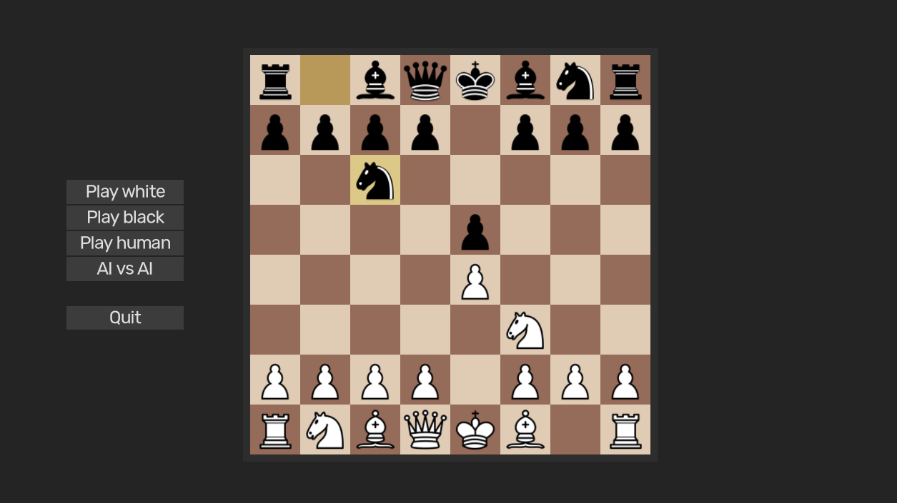

# Chess Game

 <!-- Replace this link with the actual URL of your image -->

This is a chess game project developed using the **Godot Engine** and the **C#** programming language.

## Requirements

### Necessary Tools:
- **Godot Engine .NET** (version 4.2 or higher).
- **.NET SDK 8.0 or higher** to compile the C# scripts.

### Installation

1. **Godot**: If you don’t have Godot installed, you can download it from the official website: [Godot Engine](https://godotengine.org/download).
2. **.NET SDK**: You will also need to install the .NET SDK to run the C# scripts: [Download .NET SDK](https://dotnet.microsoft.com/download).

### Opening the Project

1. Clone this repository or download the project as a ZIP file.
2. Open **Godot Engine**.
3. On the start screen, select "Import Project" and navigate to the folder where you downloaded the project.
4. Select the `project.godot` file and open the project.

## Folder Structure

- **Assets/**: Contains the visual and sound resources for the game.
- **Materials/**: Files related to the materials used in the game scenes.
- **Properties/**: Configuration files for the C# project.
- **Scenes/**: Folder containing the different game scenes, including the chessboard and pieces.
- **Scripts/**: Contains all the C# scripts that implement the game logic, AI, and player interactions.
- **Shaders/**: Contains the shaders used in the game's graphics.

## Project

This project aims to implement a functional chess game with the following features:
- **Chessboard and pieces**: A visual system where the player can interact with the pieces.
- **Artificial Intelligence**: An AI implementation to challenge the player in matches.
- **User Interface**: Visual elements that make it easier for users to interact with the game.

## Releases

When downloading the game from the **Releases** section, if you want to visualize the AI’s output in the console (e.g., the search depth being used), you must execute the version of the game that includes the console.

To do this:
1. Locate the executable that opens with a console window (e.g., `Chess.console.exe`).
2. Run this executable to see real-time logs, such as the AI’s search depth and other output.
